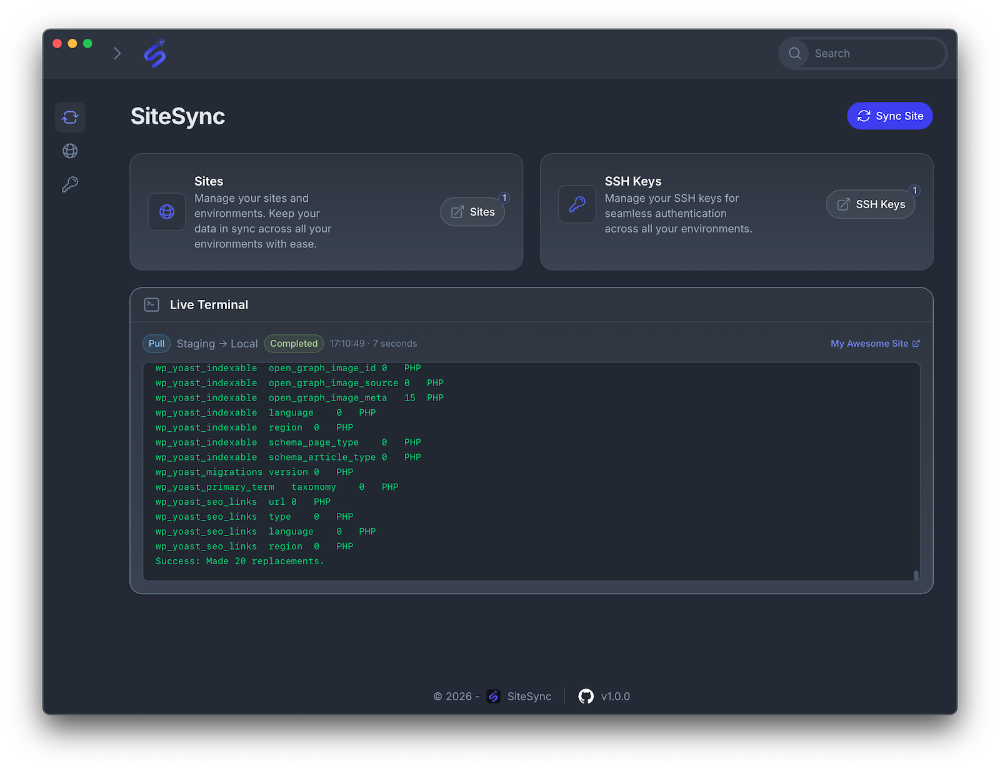

# SiteSync

A desktop WordPress site migration and synchronisation tool — a modern replacement for the `wordmove` CLI.



---

## Overview

SiteSync provides a Filament-powered admin UI for managing multiple WordPress sites and syncing their databases and files between environments (local ↔ staging ↔ production). It handles SSH connectivity, encrypted credential storage, real-time sync logging, and site discovery from existing WordPress installs.

Built with Laravel 12, Filament 5, and NativePhp — runs as a web app or desktop app.

---

## Features

- **Bidirectional sync** — push or pull between any two environments
- **Granular scope control** — sync database, themes, plugins, mu-plugins, uploads, WordPress core, or custom paths independently
- **Database sync** — dump, import, and automatic URL/path search-replace (via WP-CLI or mysqldump)
- **SSH key management** — store keys as file paths or inline content; encrypted at rest
- **Automatic backups** — pre-sync SQL backups before any database is overwritten
- **Site discovery** — auto-detect WordPress installs from a local path; parses `wp-config.php` and `movefile.yml`
- **Movefile import** — import site configs directly from existing movefile YAML
- **Sync history** — full log of every sync with command output, status, and duration
- **Live terminal** — real-time sync output streamed to the dashboard
- **CLI commands** — run push/pull syncs from the terminal without the UI
- **Desktop app** — ships as a NativePhp desktop application

---

## Tech Stack

| Layer | Package |
|---|---|
| Framework | Laravel 12 |
| Admin UI | Filament 5 |
| Frontend | Livewire 4, Alpine.js, Tailwind CSS v4 |
| Desktop | NativePhp 2 |
| Queue / Cache / Sessions | SQLite (database driver) |
| Testing | Pest 4 |
| Process execution | symfony/process |
| YAML parsing | symfony/yaml |

---

## Requirements

- PHP 8.4+
- Node.js 20+
- Laravel Herd (or a compatible local server)
- WP-CLI on target servers (recommended) or `mysqldump`
- `rsync` and `ssh` available in the system PATH

---

## Installation

```bash
git clone https://github.com/your-org/sitesync.git
cd sitesync
composer run setup
```

The `setup` script runs: `composer install`, copies `.env.example` → `.env`, generates the app key, runs migrations, and builds frontend assets.

### Manual setup

```bash
composer install
cp .env.example .env
php artisan key:generate
php artisan migrate --force
npm install
npm run build
```

---

## Development

```bash
# Start Laravel server, queue worker, log viewer, and Vite concurrently
composer run dev

# Or for the NativePhp desktop app
composer run native:dev
```

The app will be available at `https://sitesync.test` via Laravel Herd.

---

## Artisan Commands

### Discover a WordPress site

Parses `wp-config.php` (and `movefile.yml` if present) to create site and environment records automatically.

```bash
php artisan sitesync:discover {path} [--name=] [--adapter=wpcli]
```

### Push sync

```bash
php artisan sitesync:push {site} [--from=local] [--to=] [--db] [--themes] [--plugins] [--mu-plugins] [--uploads] [--core] [--files] [--all] [--path=*]
```

### Pull sync

```bash
php artisan sitesync:pull {site} [--from=] [--to=local] [--db] [--themes] [--plugins] [--mu-plugins] [--uploads] [--core] [--files] [--all] [--path=*]
```

`{site}` accepts either the site ID or name. `--files` is shorthand for `--themes --plugins --uploads`. `--all` syncs everything.

---

## Data Model

```
sites
  └── environments (local, staging, production, …)
        └── sync_logs (push/pull history with output)
ssh_keys (reusable across environments)
```

Sensitive fields (`db_password`, `ssh_password`, SSH key content) are encrypted at rest using Laravel's `encrypted` cast.

---

## Sync Behaviour

- Local ↔ remote sync is supported in both directions.
- Remote-to-remote sync is **not** supported; use a local environment as an intermediary.
- Database sync steps: backup destination → dump source → import → URL search-replace → path search-replace (if paths differ).
- File sync uses `rsync` over SSH with configurable exclusions. Default exclusions include `.git/`, `node_modules/`, `wp-config.php`.
- SSH string keys are written to a temporary file (chmod 600) and cleaned up on process exit.

---

## Running Tests

```bash
composer run test
# or
php artisan test --compact
```

---

## License

MIT
